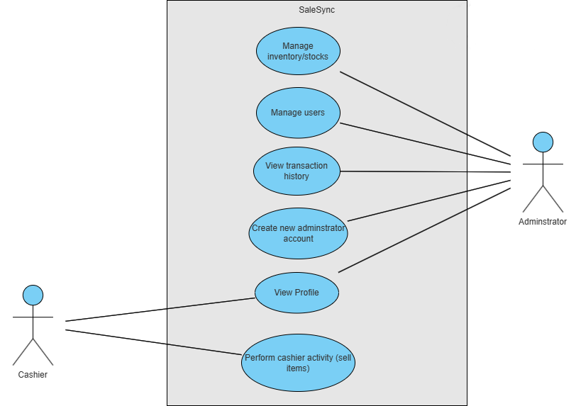
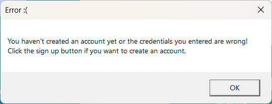
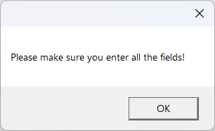
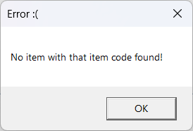

# Backend

The backend of this application was written by A.M. Senuka Bandara. This code is divided across 7 interfaces. Most of these interfaces are fully working on both the front end and backend but some of them haven't been implemented yet. These features were planned during project planning but we failed to implement them due to lack of time. These interfaces are:

✅ - implemented

❌ - not implemented

* **Login UI** ✅
* **Signup UI** ✅
* **Cashier dashboard** ✅
    
    - My profile ✅

* **Admin dashboard** ✅

    - Inventory ✅
    - My profile ✅
    - History ❌
    - Users ❌


In this section of the documentation, we will be discussing about 3 main concepts that must be identified in the application flow in addition the interface backend logic.

* **Use cases**
* **Database**
* **Current user identification**

<center>+</center>

* **Interfaces**

## Use cases

The application consists of 2 types of users, namely "admin" and "cashier". The admin accounts have more priviledges and/or access than cashier accounts.





## Database

### Structure

The database we used for this application is `SQL`. We used *SQL Server Management Studio 19* for laying out the foundation & structure of the database. The database consists of 3 tables namely:

* users - stores information about the users
* history - keeps track of transactions
* stocks - stores all incoming stock information

#### `users` table

<div align="center">

|Column Name| Data type|
|--- | :---: |
|user__id|text|
|password|text|
|full_name|text|
|phone_number|text|
|nic|text|
|image_path|text|
|admin|text|


</div>

`user__id` - This is the 'username' of the user

`password` - The password of the user

`full_name` - The full name entered by the user

`phone_number` - Phone number of the user

`nic` - National Identity Card number entered by the user

`image_path` - The path of the profile image if selected by the user upon registration

`admin` - If the user is admin. Would be "yes" if it's an admin user and "no" if it's a cashier user. It's obvious that the usage of 'text' data type for this doesn't make sense. This is because the SMMS doesn't allow boolean data types.

#### `history` table


<div align="center">

|Column Name| Data type|
|--- | :---: |
|item_code|text|
|sold_quantity|int|
|profit_earned|int|


</div>

`item_code` - The unique code for the item

`sold_quantity` - The amount of items sold from stock

`profit_earned` - The profit earned, supposed to be calculated through *Selling price - Purchase price*


#### `stocks` table


<div align="center">

|Column Name| Data type|
|--- | :---: |
|item_code|text|
|item_name|text|
|quantity|int|
|selling_price|int|
|purchase_price|int|


</div>


`item_code` - The unique code for the item

`item_name` - The name of the item

`quantity` - The amount of items available in stock

`selling_price` - The selling price of the item

`purchase_price` The purchasing price of the item


### Code

To ease the development of database usage, we have created a database utility which is simply a custom class that provides a `DatabaseAPI` object. This object has a few methods that allows to fetch and insert data to the database without having to write queries everytime we have to do a specific action. The code is as follows.


```cs

using System;
using System.Collections.Generic;
using System.Linq;
using System.Text;
using System.Threading.Tasks;
using System.Data.SqlClient;
using System.Windows;

namespace esoftprojecttest.utils
{
    internal class DatabaseAPI
    {
        private SqlConnection con;
        
        public DatabaseAPI()
        {

            
            con = new SqlConnection("Data Source=YETI-PC\\MSSQLSERVER01;Initial Catalog=saleSyncDB;Integrated Security=True;");
        }

        public Dictionary<string, dynamic>? login(string username, string password)
        {

            SqlCommand cmd = new SqlCommand("SELECT * FROM users WHERE CONVERT(VARCHAR, user__id) = '" + username + "' AND CONVERT(VARCHAR, password) = '" + password + "'", con);
            con.Open();

            cmd.ExecuteNonQuery();

            SqlDataReader reader = cmd.ExecuteReader();

            if (reader.Read() == false) { con.Close(); return null; }


            var return_value = new Dictionary<string, dynamic>() {
                { "full_name", reader["full_name"].ToString()},
                {"admin", reader["admin"].ToString() == "yes" ? true : false },
                {"nic", reader["nic"].ToString() },
                {"phone_number", reader["phone_number"].ToString() },
                {"image_path", reader["image_path"]}

            };

            

            return return_value;
            
            
        }

        public bool create_user(string username, string password, string fullname, string phoneNumber, string nic, string imagePath, string admin ) {


            SqlCommand cmd = new SqlCommand("INSERT INTO users (user__id, password, full_name, phone_number, nic, image_path, admin) VALUES('" + username +"', '" + password + "', '" + fullname +"', '"+ phoneNumber +"', '"+nic+"', '"+imagePath+"', '"+admin+"')", con);
            con.Open();

            try {
                cmd.ExecuteNonQuery();
                MessageBox.Show("Succesfully registered user! You can now return to the SignIn page to login!", "Success!", MessageBoxButton.OK);
                
                return true;

            } catch (Exception ex)
            {
                MessageBox.Show($"Error while registering user {ex}");
            }

            finally { con.Close(); }


            return false;

        }

        public bool add_inventory(string item_code, string item_name, int quantity, int selling_price, int purchase_price)
        {

            SqlCommand cmd = new SqlCommand("INSERT INTO stocks (item_code, item_name, quantity, selling_price, purchase_price) VALUES ('"+item_code+"', '"+item_name+"', "+quantity+", "+selling_price+", "+purchase_price+")", con);
            con.Open();

            try
            {
                cmd.ExecuteNonQuery();
                

            }
            catch (Exception ex)
            {

                MessageBox.Show($"An error occured when adding to inventory {ex}", "Error", MessageBoxButton.OK);
                return false;
            }
            finally { con.Close(); }

            return true;
        }

        public dynamic[] get_stock(string itemCode)
        {
            SqlCommand cmd = new SqlCommand("SELECT * FROM stocks WHERE CONVERT(VARCHAR, item_code) = '"+itemCode+"'",con);

            con.Open();

            try
            {
                cmd.ExecuteNonQuery();


                SqlDataReader reader = cmd.ExecuteReader();

                if (reader.Read() == false) { con.Close(); return null; }

                return
                [
                    reader["item_code"].ToString(),
                    Convert.ToInt32(reader["selling_price"]),
                ];

            }
            catch (Exception ex)
            {
                throw ex;
                MessageBox.Show($"An error occured when fetching data {ex}");

            } 
            finally { con.Close();  }

        }

        
    }
}


```

> The purposes of these methods are equal to the corresponding method names respectively.

## Current user identification

Since the application works with two types of users, it is necessary to identify the current user in order to provide appropriate functionality for them. This need was specially encountered when rendering the "Profile" page. It needs a way to access the data of the current user somehow.

To overcome this problem, we decided to create a simple `Dictionary` object that will store current user information in it. This object gets created when the user logs in, inside the login page. Afterwards, this object is passed around to every other interface that is created as the user continues to navigate through interfaces. This allows to reduce unncessary database calls.

The dictionary object definition is as follows:

```cs

new Dictionary<string, dynamic>() {
                { "full_name", reader["full_name"].ToString()},
                {"admin", reader["admin"].ToString() == "yes" ? true : false },
                {"nic", reader["nic"].ToString() },
                {"phone_number", reader["phone_number"].ToString() },
                {"image_path", reader["image_path"]}

            };
```

These properties are also explanatory by their property names.

## Interfaces

The interface logic will be discussed below. The frontend is designed with XAML, therefore, the backend is linked with methods from the code set to properties like "Click" or "MouseDown". Other properties are also accessed within the code since these elements are given appropriate IDs/names. The errors displayed are simple `MessageBoxes`

### Login UI

The login UI works by simply calling the database for credentials matching the username AND the password. If a result is not found, this error pops up:




#### Code

```cs
using esoftprojecttest.utils;
using SaleSync.uis;
using System.Diagnostics.Eventing.Reader;
using System.Text;
using System.Windows;
using System.Windows.Controls;
using System.Windows.Data;
using System.Windows.Documents;
using System.Windows.Input;
using System.Windows.Media;
using System.Windows.Media.Imaging;
using System.Windows.Navigation;
using System.Windows.Shapes;

namespace esoftprojecttest
{
	/// <summary>
	/// Interaction logic for MainWindow.xaml
	/// </summary>
	public partial class Login_window : Window
	{
		private DatabaseAPI database = new DatabaseAPI();

		public Login_window()
		{
			InitializeComponent();
		}

		private void textID_MouseDown(object sender, MouseButtonEventArgs e)
		{
			txtID.Focus();
		}

		private void txtID_TextChanged(object sender, TextChangedEventArgs e)
		{
			if (!string.IsNullOrEmpty(txtID.Text) && txtID.Text.Length > 0)
			{
				textID.Visibility = Visibility.Collapsed;
			}
			else 
			{
				textID.Visibility = Visibility.Visible;
			}
		}

		private void textPassword_MouseDown(object sender, MouseButtonEventArgs e)
		{
			txtPassword.Focus();
		}

		private  void txtPassword_PasswordChanged(object sender, RoutedEventArgs e)
		{
			if (!string.IsNullOrEmpty(txtPassword.Password) && txtPassword.Password.Length > 0)
			{
				textPassword.Visibility = Visibility.Collapsed;
			}
			else
			{
				textPassword.Visibility = Visibility.Visible;
			}
		}


		private void Image_MouseUp(object sender, MouseButtonEventArgs e)
		{
			Application.Current.Shutdown();
		}

	

        private void Login_Click(object sender, RoutedEventArgs e)
        {
			var login = database.login(txtID.Text, txtPassword.Password);

			if (login == null)
			{
				MessageBox.Show("You haven't created an account yet or the credentials you entered are wrong! Click the sign up button if you want to create an account.", "Error :(", MessageBoxButton.OK);
				return;
			}

			this.Hide();
			if (login["admin"] == true)
			{
				Dashbord_Screen admin = new Dashbord_Screen(user: login);
				admin.Show();
			} else
			{
				cashier_dashbord cashier_Dashbord = new cashier_dashbord(user: login);
				cashier_Dashbord.Show();
			}

			
        }

        private void SignUp_Click(object sender, RoutedEventArgs e)
        {
			this.Hide(); // Hide sign in screen
			SignUp_window signUpWindow = new SignUp_window();

			signUpWindow.Show();
        }
    }

}

```

### Signup UI

Registers a user. If a value is not entered in the textfields, an error like this pops up:



> It is important to note that if the `is_admin` parameter is passed to be true  the database call for signing up will be created with admin set to yes. Meaning, an adminstrator account will be created.

#### Code

```cs
using esoftprojecttest.utils;
using Microsoft.Win32;
using System;
using System.Collections.Generic;
using System.Linq;
using System.Text;
using System.Threading.Tasks;
using System.Windows;
using System.Windows.Controls;
using System.Windows.Data;
using System.Windows.Documents;
using System.Windows.Input;
using System.Windows.Media;
using System.Windows.Media.Imaging;
using System.Windows.Navigation;
using System.Windows.Shapes;
using static System.Net.Mime.MediaTypeNames;


namespace esoftprojecttest
{
	/// <summary>
	/// Interaction logic for Page1.xaml
	/// </summary>
	public partial class SignUp_window: Window
	{

		private DatabaseAPI database = new DatabaseAPI();
		private bool is_admin;
		public SignUp_window(bool is_admin = false)
		{
            this.is_admin = is_admin;
			InitializeComponent();
		}

		


		private void fullname_MouseDown(object sender, MouseButtonEventArgs e)
		{
			FName.Focus();
		}

        

        private void FName_TextChanged(object sender, TextChangedEventArgs e)
		{
			if (!string.IsNullOrEmpty(FName.Text) && FName.Text.Length > 0)
			{
				fullname.Visibility = Visibility.Collapsed;
			}
			else
			{
				fullname.Visibility = Visibility.Visible;
			}
		}

		private void password_text_MouseDown(object sender, MouseButtonEventArgs e)
		{
			password_txt.Focus();
		}

		private void password_txt_TextChanged(object sender, TextChangedEventArgs e)
		{
			if (!string.IsNullOrEmpty(password_text.Text) && password_text.Text.Length > 0)
			{
				password_text.Visibility = Visibility.Collapsed;
			}
			else { 
				password_text.Visibility = Visibility.Visible;
			}
		}

		private void NIC_MouseDown(object sender, MouseButtonEventArgs e)
		{
			Ncard.Focus();
		}

		private void Ncard_TextChanged(object sender, TextChangedEventArgs e)
		{
			if (!string.IsNullOrEmpty(Ncard.Text) && Ncard.Text.Length > 0)
			{
				NIC.Visibility = Visibility.Collapsed;
			}
			else
			{
				NIC.Visibility = Visibility.Visible;
			}
		}

		private void username_MouseDown(object sender, MouseButtonEventArgs e)
		{
			uname.Focus();
		}

		private void uname_TextChanged(object sender, TextChangedEventArgs e)
		{
			if (!string.IsNullOrEmpty(uname.Text) && uname.Text.Length > 0)
			{
				username.Visibility = Visibility.Collapsed;
			}
			else
			{
				username.Visibility = Visibility.Visible;
			}
		}

		private void phone_number_MouseDown(object sender, MouseButtonEventArgs e)
		{
			Pnumber.Focus();
		}

		private void Pnumber_TextChanged(object sender, TextChangedEventArgs e)
		{
			if (!string.IsNullOrEmpty(Pnumber.Text) && Pnumber.Text.Length > 0)
			{
				phone_number.Visibility = Visibility.Collapsed;
			}
			else
			{
				phone_number.Visibility = Visibility.Visible;
			}

		}

		private string imageSource;

        private void update_pro_pic(object sender, RoutedEventArgs e)
        {
            OpenFileDialog openFileDialog = new OpenFileDialog();
            openFileDialog.Filter = "Image files (*.png)|*.png";

			openFileDialog.ShowDialog();
			imageSource = openFileDialog.FileName;

			proPic.Source = new BitmapImage(new Uri($"{openFileDialog.FileName}", UriKind.Absolute)); // update UI image


        }

		private void cancel_click(object sender, RoutedEventArgs e)
		{
			this.Hide();
			Login_window login_window = new Login_window();

			login_window.Show();
		}

        private void register_click(object sender, RoutedEventArgs e)
        {

				if (uname.Text == "" || password_txt.Text == "" || FName.Text == "" || Ncard.Text == "" || Pnumber.Text == "") { MessageBox.Show("Please make sure you enter all the fields!"); return; }

			bool result = database.create_user(
					username: uname.Text,
					password: password_txt.Text,
					fullname: FName.Text,
					nic: Ncard.Text,
					phoneNumber: Pnumber.Text,
					imagePath: imageSource,
					admin: is_admin == true ? "yes" : "no"

			); 

			if (result == true)
			{
				this.Hide();
				Login_window login = new Login_window();

				login.Show();
			}
        }

        


    }
}


```

### Cashier Dashboard

Provides basic functionality for cashier activities. This interface checks if an item is present in the stocks database, if found adds it to the DataGrid table, otherwise throws an error:



This interface also requires all the fields to be entered.

This interface is missing functionality to add to the history table as planned.


#### Code

```cs

using esoftprojecttest.utils;
using System;
using System.Collections.Generic;
using System.Data.SqlClient;
using System.Linq;
using System.Text;
using System.Threading.Tasks;
using System.Windows;
using System.Windows.Controls;
using System.Windows.Data;
using System.Windows.Documents;
using System.Windows.Input;
using System.Windows.Media;
using System.Windows.Media.Imaging;
using System.Windows.Shapes;

namespace SaleSync.uis
{
    /// <summary>
    /// Interaction logic for admin_dashbord.xaml
    /// </summary>
    public partial class cashier_dashbord : Window
    {

		private Dictionary<string, dynamic> user;
		private DatabaseAPI database = new DatabaseAPI();
        private int total;
        public cashier_dashbord(Dictionary<string, dynamic> user)
        {
			this.user = user;
            InitializeComponent();
        }

		// item code
		private void itemcode_text_MouseDown(object sender, MouseButtonEventArgs e)
		{
			ICode_txt.Focus();
		}

        private void close_img(object sender, MouseButtonEventArgs e)
        {
            Application.Current.Shutdown();
        }
        private void ICode_txt_textchanged(object sender, TextChangedEventArgs e)
		{
			if (!string.IsNullOrEmpty(ICode_txt.Text) && ICode_txt.Text.Length > 0)
			{
				itemcode_text.Visibility = Visibility.Collapsed;
			}
			else
			{
				itemcode_text.Visibility = Visibility.Visible;
			}
		}

		//quantity
		private void quantity_text_MouseDown(object sender, MouseButtonEventArgs e)
		{
			quantity_txt.Focus();
		}

		private void quantity_txt_TextChanged(object sender, TextChangedEventArgs e)
		{
			if (!string.IsNullOrEmpty(quantity_txt.Text) && quantity_txt.Text.Length > 0)
			{
				quantity_text.Visibility = Visibility.Collapsed;
			}
			else
			{
				quantity_text.Visibility = Visibility.Visible;
			}
		}

        private void cashier_my_profile_click(object sender, RoutedEventArgs e)
        {
			this.Hide();

			profile_page cashier_profile = new profile_page(user);
			cashier_profile.Show();
        }

        private void sell_click(object sender, RoutedEventArgs e)
        {

            MessageBox.Show($"Sold item(s)! Your total is {total}", "Happy shopping :)");

            // TODO: Add to history table

            //foreach (var item in cashier_data.Items)
            //{
            //    string item_code = "default_code";
            //    string item_name = "default_name";
            //    int quantity = 0;
            //    int selling_price = 0;
            //    int purchase_price = 0;

            //    var properties = item.GetType().GetProperties();
            //    foreach (var property in properties)
            //    {
            //        string propertyName = property.Name;
            //        string propertyValue = property.GetValue(item).ToString();


            //        switch (propertyName)
            //        {
            //            case "ItemCode":
            //                item_code = propertyValue;
            //                break;

            //            case "ItemName":
            //                item_name = propertyValue;
            //                break;

            //            case "Quantity":
            //                quantity = Convert.ToInt32(propertyValue);
            //                break;

                    
                     

            //            default: break;
            //        }
            //    }
            //}
        }

           

        private void enter_click(object sender, RoutedEventArgs e)
        {
            if (ICode_txt.Text == "" || quantity_txt.Text == "") { MessageBox.Show("Please make sure you enter all the fields!"); return; }

            dynamic[] stock = database.get_stock(itemCode: ICode_txt.Text);

            // stock[]:
            //    0: irem_code
            //    1: selling_price


			if (stock == null) { MessageBox.Show("No item with that item code found!", "Error :("); return; }

			cashier_data.Items.Add(new {
				ItemCode = ICode_txt.Text,
				Quantity = quantity_txt.Text,

                ItemName = stock[0],
				Price = stock[1].ToString(),
				Total = Convert.ToInt32(quantity_txt.Text) * stock[1]


			}) ;

            total = Convert.ToInt32(quantity_txt.Text) * stock[1];
        }


    }
}


```

### Admin Dashboard

The interface for admin dashboard provides access to 6 actions.

#### Code

```cs

using SaleSync.uis;
using System;
using System.Collections.Generic;
using System.Linq;
using System.Text;
using System.Threading.Tasks;
using System.Windows;
using System.Windows.Controls;
using System.Windows.Data;
using System.Windows.Documents;
using System.Windows.Input;
using System.Windows.Media;
using System.Windows.Media.Imaging;
using System.Windows.Shapes;

namespace esoftprojecttest
{
    /// <summary>
    /// Interaction logic for Dashbord_Screen.xaml
    /// </summary>
    public partial class Dashbord_Screen : Window
    {
        private Dictionary<string, dynamic> user;
        public Dashbord_Screen(Dictionary<string, dynamic> user )
        {
            this.user = user;
            InitializeComponent();


            welcome_text.Text = $"Welcome {(user != null ? user["full_name"] : "user")} to the Admin dashboard! You can click your desired action from the list on the left!";


        }


        private void close_img(object sender, MouseButtonEventArgs e)
        {
            Application.Current.Shutdown();
        }

        private void admin_inventory_click(object sender, RoutedEventArgs e)
        {
            this.Hide();

            inventory _inventory = new inventory(user);
            _inventory.Show();
        }

        private void admin_history_click(object sender, RoutedEventArgs e)
        {

            this.Hide();

            history _history = new history();
            _history.Show();

        }

        private void admin_my_profile_click(object sender, RoutedEventArgs e)
        {
            this.Hide();

            profile_page profile = new profile_page(user);
            profile.Show();

        }

		private void admin_logout_click(object sender, RoutedEventArgs e)
		{
            this.Hide();

            Login_window login = new Login_window();
            login.Show();
		}

		private void admin_signup_click(object sender, RoutedEventArgs e)
		{
            this.Hide();

            SignUp_window signup = new SignUp_window(is_admin: true); // Set is_admin to true since we are creating an admin account
            signup.Show();
		}

        private void admin_users_click(object sender, RoutedEventArgs e)
        {
            this.Hide();

            users_window users = new users_window(); // Incomplete
            users.Show();
        }
      
    }
}


```

### My profile

Displays user information of the current user. It also provides a log out button.

```cs

using esoftprojecttest;
using esoftprojecttest.utils;
using System;
using System.Collections.Generic;
using System.Linq;
using System.Text;
using System.Threading.Tasks;
using System.Windows;
using System.Windows.Controls;
using System.Windows.Data;
using System.Windows.Documents;
using System.Windows.Input;
using System.Windows.Media;
using System.Windows.Media.Imaging;
using System.Windows.Shapes;

namespace SaleSync.uis
{
    /// <summary>
    /// Interaction logic for profile_page.xaml
    /// </summary>
    public partial class profile_page : Window
    {
        private Dictionary<string, dynamic> user;

        public profile_page(Dictionary<string, dynamic> user)
        {
            this.user = user;
            InitializeComponent();

            user_name.Text = user["full_name"];
            user_nic.Text = user["nic"];
            user_phonenumber.Text = user["phone_number"];


            // Image Code

            //if (user["image_path"] != null || user["image_path"] != "")
            //{
            //    proPic.Source = new BitmapImage(new Uri(user["image_path"], UriKind.Absolute));
            //}
            //else

            //    MessageBox.Show("H");
            //{
            //    proPic.Source = new BitmapImage(new Uri("/Resources/profile.png", UriKind.Relative));
            //}

        }
        private void close_btn(object sender, MouseButtonEventArgs e)
        {
            Application.Current.Shutdown();
        }

        private void logout(object sender, EventArgs e)
        {
            this.Hide();

            Login_window login = new Login_window();
            login.Show();
            
        }

        private void Back_btn(object sender, RoutedEventArgs e)
        {
            this.Hide();

            if (user["admin"] == true)
            {
                Dashbord_Screen admin = new Dashbord_Screen(user);
                admin.Show();
            } else
            {
                cashier_dashbord cashier = new cashier_dashbord(user);
                cashier.Show();
            }
        }
    }
}


```

### Inventory

The inventory screen allows adminstrators to view/add stock data. After adding new stocks, the "Add to Database" button commits the new data to the database's stocks table.


#### Code

```cs

using esoftprojecttest;
using esoftprojecttest.utils;
using System;
using System.Collections.Generic;
using System.Linq;
using System.Text;
using System.Threading.Tasks;
using System.Windows;
using System.Windows.Controls;
using System.Windows.Data;
using System.Windows.Documents;
using System.Windows.Input;
using System.Windows.Media;
using System.Windows.Media.Imaging;
using System.Windows.Shapes;

namespace SaleSync.uis
{
	/// <summary>
	/// Interaction logic for inventory.xaml
	/// </summary>
	public partial class inventory : Window
	{

		private DatabaseAPI database = new DatabaseAPI();
		private Dictionary<string, dynamic> user;
		public inventory(Dictionary<string, dynamic> user)
		{
			this.user = user;
			InitializeComponent();
		}

        private void close_img(object sender, MouseButtonEventArgs e)
        {
            Application.Current.Shutdown();
        }
        public void Window_MouseDown(object sender, MouseButtonEventArgs e)
		{
			if (Mouse.LeftButton == MouseButtonState.Pressed)
				this.DragMove();
		}


		//item code
		private void itemcode_text_MouseDown(object sender, MouseButtonEventArgs e)
		{
			ICode_txt.Focus();
		}


		private void ICode_txt_textchanged(object sender, TextChangedEventArgs e)
		{
			if (!string.IsNullOrEmpty(ICode_txt.Text) && ICode_txt.Text.Length > 0)
			{
				itemcode_text.Visibility = Visibility.Collapsed;
			}
			else
			{
				itemcode_text.Visibility = Visibility.Visible;
			}
		}

		//item name
		private void itemname_text_MouseDown(object sender, MouseButtonEventArgs e)
		{
			IName_txt.Focus();
		}

		private void IName_txt_TextChanged(object sender, TextChangedEventArgs e)
		{
			if (!string.IsNullOrEmpty(IName_txt.Text) && IName_txt.Text.Length > 0)
			{
				itemname_text.Visibility = Visibility.Collapsed;
			}
			else
			{
				itemname_text.Visibility = Visibility.Visible;
			}
		}


		//quantity 
		private void quantity_text_MouseDown(object sender, MouseButtonEventArgs e)
		{
			quantity_txt.Focus();
		}

		private void quantity_txt_TextChanged(object sender, TextChangedEventArgs e)
		{
			if (!string.IsNullOrEmpty(quantity_txt.Text) && quantity_txt.Text.Length > 0)
			{
				quantity_text.Visibility = Visibility.Collapsed;
			}
			else
			{
				quantity_text.Visibility = Visibility.Visible;
			}
		}


		// purchase price
		private void purchase_price_text_MouseDown(object sender, MouseButtonEventArgs e)
		{
			purchase_price_txt.Focus();
		}

		private void purchase_price_txt_TextChanged(object sender, TextChangedEventArgs e)
		{
			if (!string.IsNullOrEmpty(purchase_price_txt.Text) && purchase_price_txt.Text.Length > 0)
			{
				purchase_price_text.Visibility = Visibility.Collapsed;
			}
			else
			{
				purchase_price_text.Visibility = Visibility.Visible;
			}
		}


		// selling price
		private void selling_price_text_MouseDown(object sender, MouseButtonEventArgs e)
		{
			selling_price_txt.Focus();
		}

		private void selling_price_txt_TextChanged(object sender, TextChangedEventArgs e)
		{
			if (!string.IsNullOrEmpty(selling_price_txt.Text) && selling_price_txt.Text.Length > 0)
			{
				selling_price_text.Visibility = Visibility.Collapsed;
			}
			else
			{
				selling_price_text.Visibility = Visibility.Visible;
			}
		}

		private void clear_all_fields()
		{
			ICode_txt.Clear();
			IName_txt.Clear();
			quantity_txt.Clear();
			selling_price_txt.Clear();
			purchase_price_txt.Clear();
		}

		private void inventory_enter_data_click(object sender, RoutedEventArgs e)
		{

			if (ICode_txt.Text == "" || IName_txt.Text == "" || quantity_txt.Text == "" || selling_price_txt.Text == "" || selling_price_txt.Text == "")
			{
				MessageBox.Show("You didn't enter all the required fields!", "Error", MessageBoxButton.OK);
				return;
			}


			inventory_table.Items.Add(new { ItemCode = ICode_txt.Text,
				ItemName = IName_txt.Text,
				Quantity = quantity_txt.Text,
				SellingPrice = selling_price_txt.Text, PurchasePrice = purchase_price_txt.Text });

			clear_all_fields();

		}

		private void inventory_clear_fields_click(object sender, RoutedEventArgs e)
		{
			clear_all_fields();

		}

		private void inventory_exit_click(object sender, RoutedEventArgs e)
		{
			this.Hide();

			Dashbord_Screen admin_dashboard = new Dashbord_Screen(user);
			admin_dashboard.Show();

		}

		private void inventory_add_to_database_click(object sender, RoutedEventArgs e)
		{


			foreach (var item in inventory_table.Items)
			{
				string item_code = "default_code";
				string item_name = "default_name";
				int quantity = 0;
				int selling_price = 0;
				int purchase_price = 0;

				var properties = item.GetType().GetProperties();
				foreach (var property in properties)
				{
					string propertyName = property.Name;
					string propertyValue = property.GetValue(item).ToString();


					switch (propertyName)
					{
						case "ItemCode":
							item_code = propertyValue;
							break;

						case "ItemName":
							item_name = propertyValue;
							break;

						case "Quantity":
							quantity = Convert.ToInt32(propertyValue);
							break;

						case "SellingPrice":
							selling_price = Convert.ToInt32(propertyValue);
							break;

						case "PurchasePrice":
							purchase_price = Convert.ToInt32(propertyValue);
							break;

						default: break;
					}
				}

				bool result_value = database.add_inventory(
					item_code: item_code,
					item_name: item_name,
					quantity: quantity,
					purchase_price: purchase_price,
					selling_price: selling_price

					);

				if (result_value) {
					
					clear_all_fields();
					MessageBox.Show("Data added to database succesfully!"); 
				}
			}


		}

        private void inventory_table_SelectionChanged(object sender, SelectionChangedEventArgs e)
        {

        }
    }

      
    }


```

### History & User interfaces

These interfaces haven't been implemented and hence, are empty windows with no functionality.